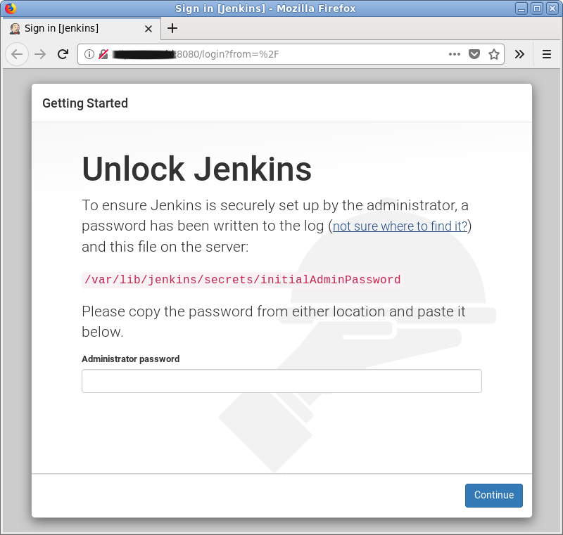
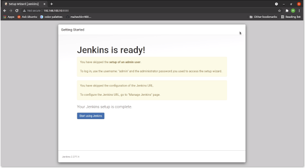

# Installation of Jenkins Server
## Installaion JDK 8
~~~sh
[root@jenkins ] yum -y install java-1.8.0-openjdk java-1.8.0-openjdk-devel
[root@jenkins ] cat > /etc/profile.d/java8.sh <<EOF
export JAVA_HOME=$(dirname $(dirname $(readlink $(readlink $(which javac)))))
export PATH=\$PATH:\$JAVA_HOME/bin
export CLASSPATH=.:\$JAVA_HOME/jre/lib:\$JAVA_HOME/lib:\$JAVA_HOME/lib/tools.jar
EOF
[root@jenkins ] source /etc/profile.d/java8.sh
~~~
 If another version of JDK had been installed, change the default like follows.
~~~sh
[root@jenkins ] alternatives --config java
There are 2 programs which provide 'java'.

  Selection    Command
-----------------------------------------------
   1           /usr/java/jdk1.8.0_71/jre/bin/java

 select the latest one
Enter to keep the current selection[+], or type selection number: 1
~~~
Create a `test` program and make sure it works normally.
~~~sh
[root@jenkins ] vi day.java

import java.util.Calendar;

class day {
    public static void main(String[] args) {
        Calendar cal = Calendar.getInstance();
        int year = cal.get(Calendar.YEAR);
        int month = cal.get(Calendar.MONTH) + 1;
        int day = cal.get(Calendar.DATE);
        int hour = cal.get(Calendar.HOUR_OF_DAY);
        int minute = cal.get(Calendar.MINUTE);
        System.out.println(year + "/" + month + "/" + day + " " + hour + ":" + minute);
    }
}
~~~
compile and run
~~~sh
[root@jenkins ] javac day.java
[root@jenkins ] java day
2021/5/08 20:37
~~~
## NOW TIME TO INSTALL JENKINES
get and add Jenkins official repository to `yum` repo
~~~sh
[root@jenkins ] cd /etc/yum.repos.d
[root@jenkins yum.repos.d] curl -O https://pkg.jenkins.io/redhat-stable/jenkins.repo
~~~
Import jenkins repository GPG key with `rpm` command and install Jenkins
~~~sh
[root@jenkins yum.repos.d] rpm --import https://pkg.jenkins.io/redhat-stable/jenkins.io.key
[root@jenkins yum.repos.d] yum -y install jenkins
[root@jenkins yum.repos.d] systemctl start jenkins
[root@jenkins yum.repos.d] systemctl enable jenkins
~~~
If you are using Redhat, CentOS enable `8080` port on firewall
~~~sh
[root@jenkins ~] firewall-cmd --add-port=8080/tcp --permanent
success
[root@jenkins ~] firewall-cmd --reload
success
~~~
Access to ``https://(server hostname or IP address):8080/`` with Web browser from localhost or any Client Host, then, initial admin password is required to enter initial setup. Make sure initial admin password that is saved in ``/var/lib/jenkins/secrets/initialAdminPassword`` and input it to enter setup.

This is Jenkins initial setup. Select to install suggested plugins or to install from your own selected plugins. (proceed with [SKIP] on this example)

If you'd like to change Jenkins URL, change it on here. (proceed with `Not now` on this example)

Initial setup finished. Click `Start using Jenkins` button to move Jenkins main page.

This is the Jenkins index page.

Change the admin password

[PORCESS HERE]

Installation ``Deploy over container`` plugin.

[PORCESS HERE]
